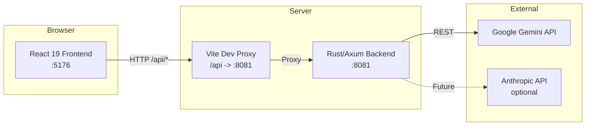
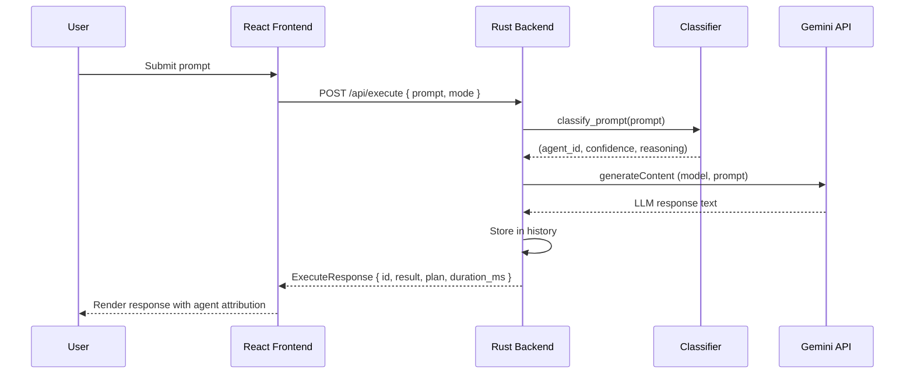
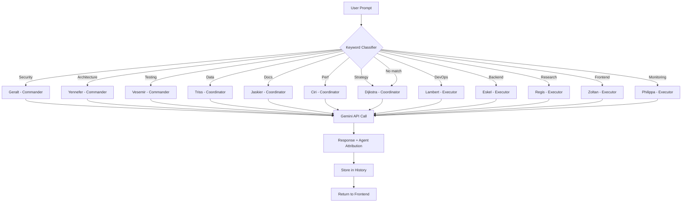
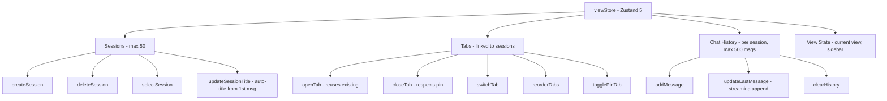
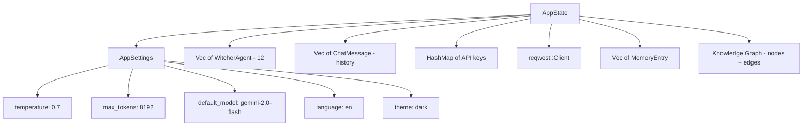

# Architecture

## System Overview

In production the Vite proxy is replaced by a static file server or reverse proxy (e.g. nginx) pointing `/api` at the Rust binary.

## Agent Classification Pipeline

Every user prompt flows through a deterministic keyword-based classification before reaching the LLM.

### Classification Rules

The classifier (`handlers.rs::classify_prompt`) applies ordered keyword matching:

1. **Architecture** keywords -> Yennefer
2. **Testing** keywords -> Vesemir
3. **Security** keywords -> Geralt
4. **Monitoring** keywords -> Philippa
5. **Data/Analytics** keywords -> Triss
6. **Documentation** keywords -> Jaskier
7. **Performance** keywords -> Ciri
8. **Strategy** keywords -> Dijkstra
9. **DevOps** keywords -> Lambert
10. **Backend/API** keywords -> Eskel
11. **Research** keywords -> Regis
12. **Frontend/UI** keywords -> Zoltan

When no keywords match, the prompt defaults to **Dijkstra** (Strategy & Planning) with a lower confidence score (0.4 vs 0.85).

## Swarm Orchestration Flow

### Agent Tier Hierarchy

| Tier        | Agents                             | Responsibility               |
|-------------|-------------------------------------|------------------------------|
| Commander   | Geralt, Yennefer, Vesemir          | Strategic domain leadership  |
| Coordinator | Triss, Jaskier, Ciri, Dijkstra     | Cross-cutting coordination   |
| Executor    | Lambert, Eskel, Regis, Zoltan, Philippa | Task-level execution    |

## Session and Tab Management

The frontend manages sessions and tabs entirely in Zustand with `persist` middleware backed by `localStorage`.

### Key Constraints

- **Max 50 sessions**: oldest sessions (and their history) are evicted when the limit is exceeded
- **Max 500 messages per session**: oldest messages are trimmed when exceeded
- **Auto-titling**: the first user message (up to 30 characters + ellipsis) becomes the session title
- **Tab pinning**: pinned tabs cannot be closed via `closeTab`
- **Tab deduplication**: opening a tab for an already-tabbed session reuses the existing tab

## Backend State Architecture

The `AppState` is wrapped in `Arc<Mutex<...>>` and shared across all Axum handlers. The lock is dropped before any async HTTP calls to avoid holding it across await points.
